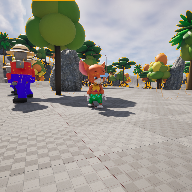

# Project Name  COMP3023w25

## Description
Sample code for our Game and simulation programming class, comp3023 in winter '25 semester.    
 
## Usage
Clone, or download the zip, to a local directory. Open in Unreal Engine 5.4 or newer

## Attributions
1. fanfare , fvcalderan,  < https://opengameart.org/content/classic-fanfare-lick >
2. background music, cynicmusic, < https://opengameart.org/content/crystal-cave-song18 >
3. clapping, qubodup, < https://opengameart.org/content/well-done >
4. Background image, Artūras Kokorevas, Pexels, < https://www.pexels.com/photo/icelandic-landscape-at-sunset-with-jimny-29847092/ >
5. Welcome message, ttsmaker, < https://ttsmaker.com >
6. iron cage, Green Bug Games on Fab, Valley of Guldur, < https://www.fab.com/listings/968226aa-fce4-4038-a3f0-e7c2bc0d2558 >
7. man in a suit, makehuman character, < https://static.makehumancommunity.org/  >
8. old man, mixamo, < https://www.mixamo.com/ >
9. swirling transporter effect, VFX Tornado by UrTanBe, ( https://www.fab.com/listings/8a7c54cb-2d94-4a9f-89b7-3f2260d8b04d )
10. smoothed rock pbr, freepbr.com, < https://freepbr.com/product/eroded-smoothed-rockface/ >
11. brick wall, ambientcg, < https://ambientcg.com/view?id=Bricks097 >
12. Mouse character from Mixamo, < https://www.mixamo.com/ > 
13. Cow character from Fab, < https://www.fab.com/listings/1f46f60b-d850-4b7c-8854-6647e4d12975 >
14. tree models from Fab, < https://www.fab.com/listings/dbc49f41-e739-40c4-a09c-3587d30180de >

